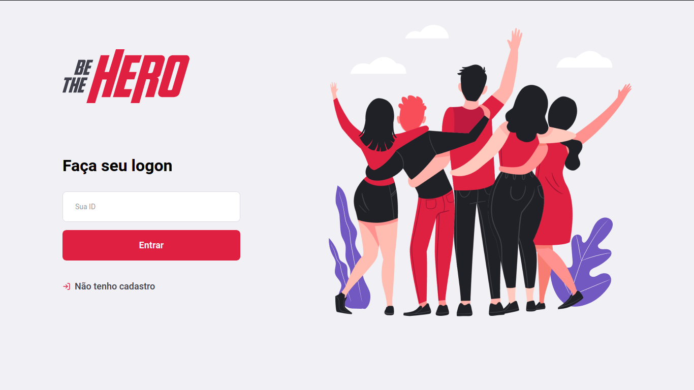
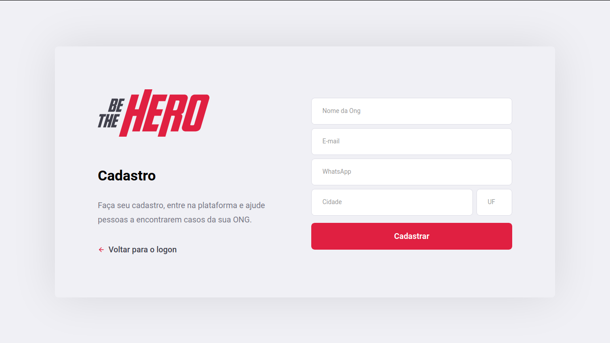
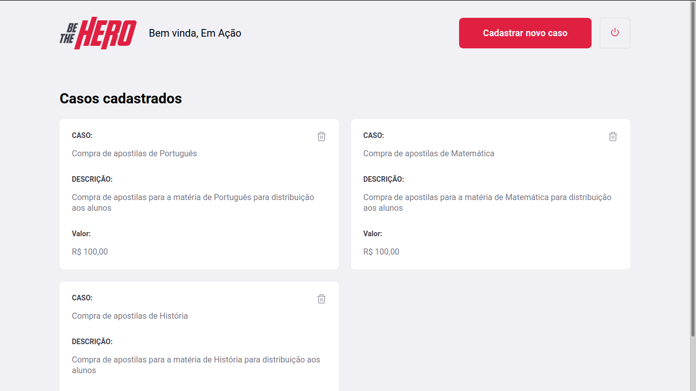
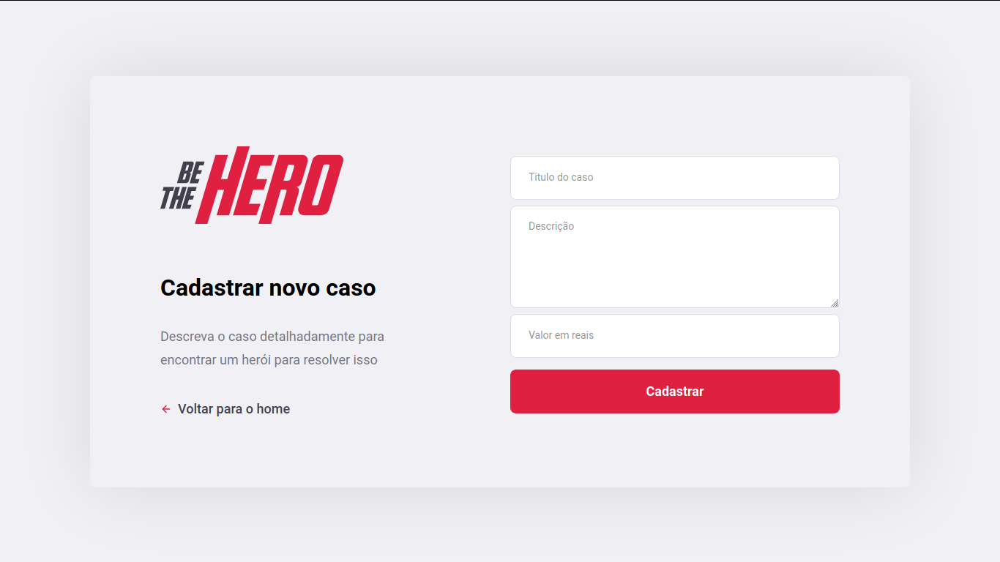
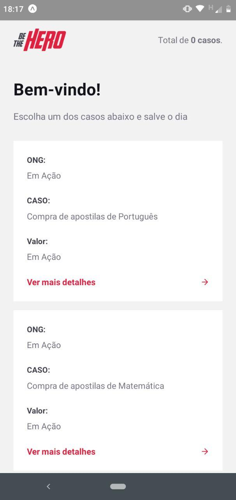
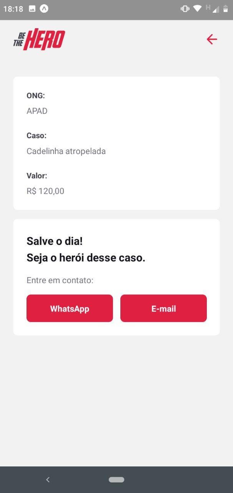

# Be The Hero - Semana Omnistack 11	
Be The Hero é uma aplicação web e mobile, desenvolvida utilizando Node.js, React e React Native. O projeto foi desenvolvido para a Semana Omnistack 11, promovida pela Rocketseat (https://rocketseat.com.br), que aconteceu entre os dias 23 e 29 de março de 2020 com o intuito de melhorar os conhecimentos sobre Javascript e auxiliar na busca de uma stack.

## Sobre o projeto
O projeto Be The Hero tem como objetivo auxiliar 
ONGs a divulgarem casos que necessitam de ajuda financeira. Composto por duas frentes, a aplicação conta com uma ferramenta de cadastro de ONGs e de casos via web, assim como um aplicativo para dispositivos mobile que permite que heróis apadrinhem os casos previamente cadastrados. 

## Tecnologias utilizadas

Para o desenvolvimento da aplicação, foram empregadas as seguintes tecnologias

#### Backend
* Node.js (https://nodejs.org)
* Express (https://expressjs.com)

#### Frontend
* React (https://reactjs.org)
* Axios (https://github.com/axios/axios)

#### Mobile
* React Native (https://reactnative.dev)
* Expo (https://expo.io)

#### Database
* SQLite (https://www.sqlite.org/index.html)
* Knex (http://knexjs.org)

## Resultados obtidos

#### Web - Logon

#### Web - Cadastro de ONG

#### Web - Listagem de casos

#### Web - Cadastro de caso

#### Mobile - Listagem de casos

#### Mobile - Detalhamento do caso

